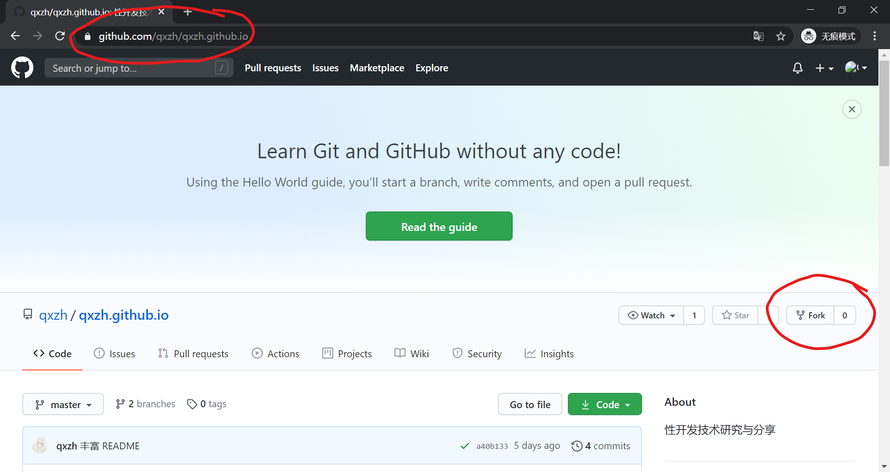
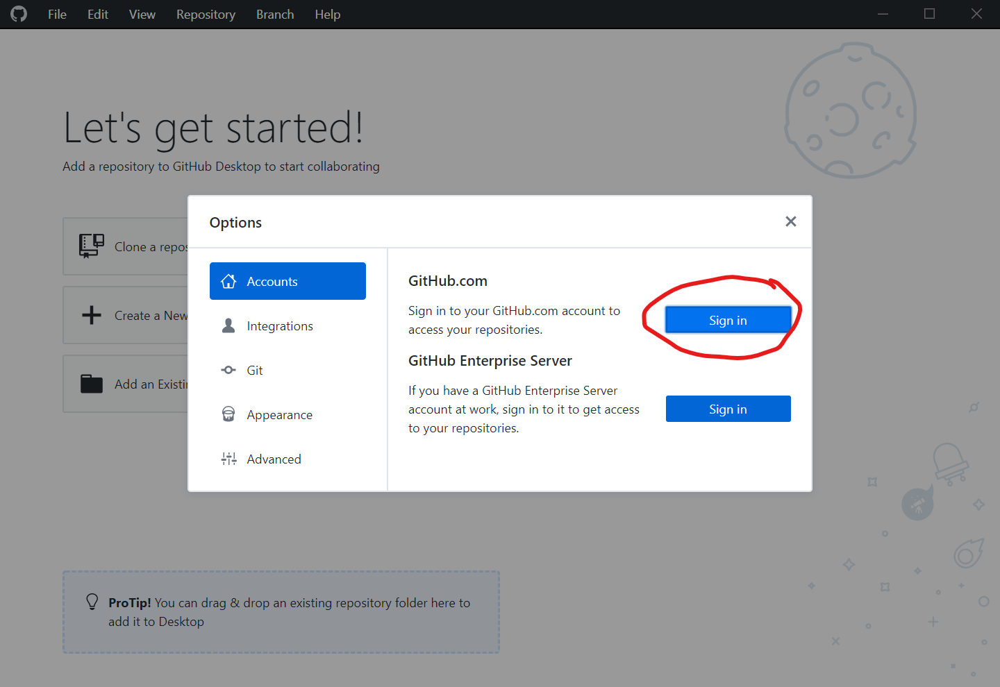
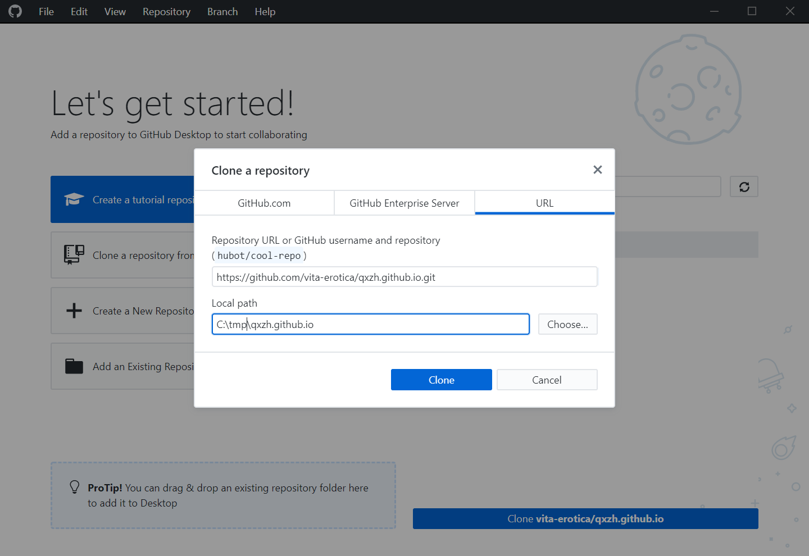
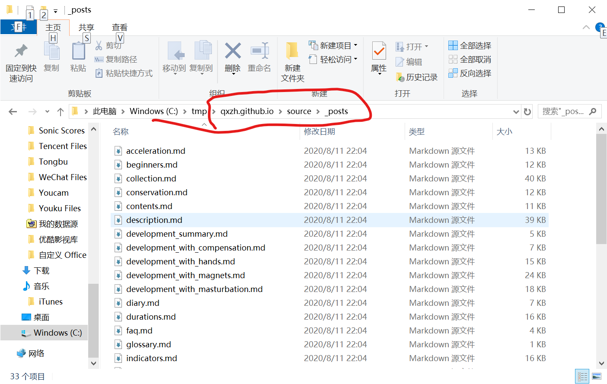
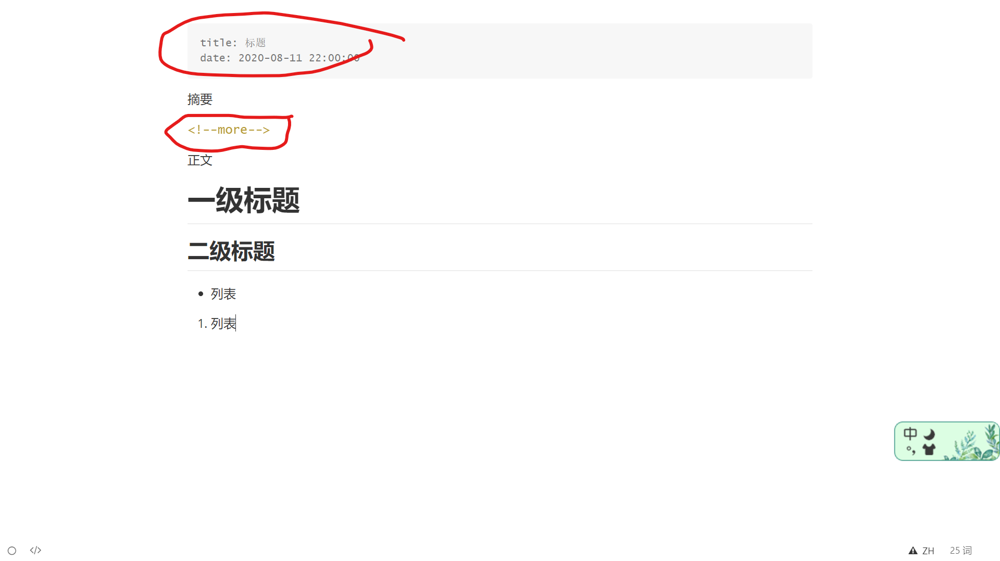
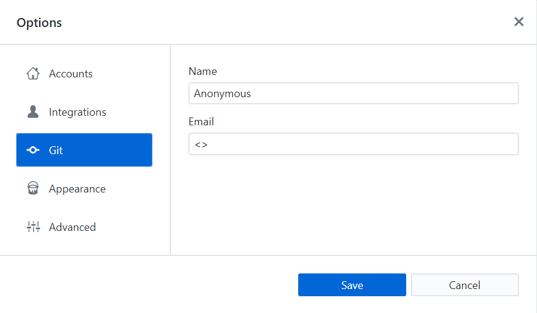
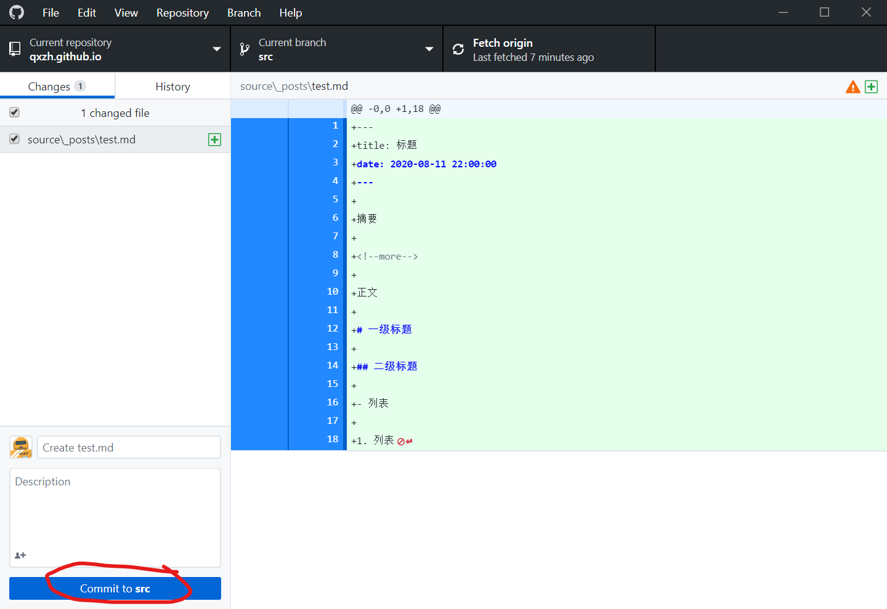
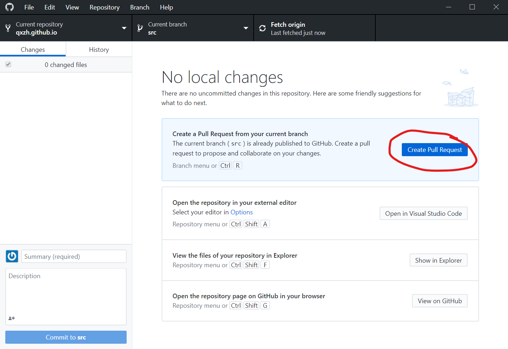
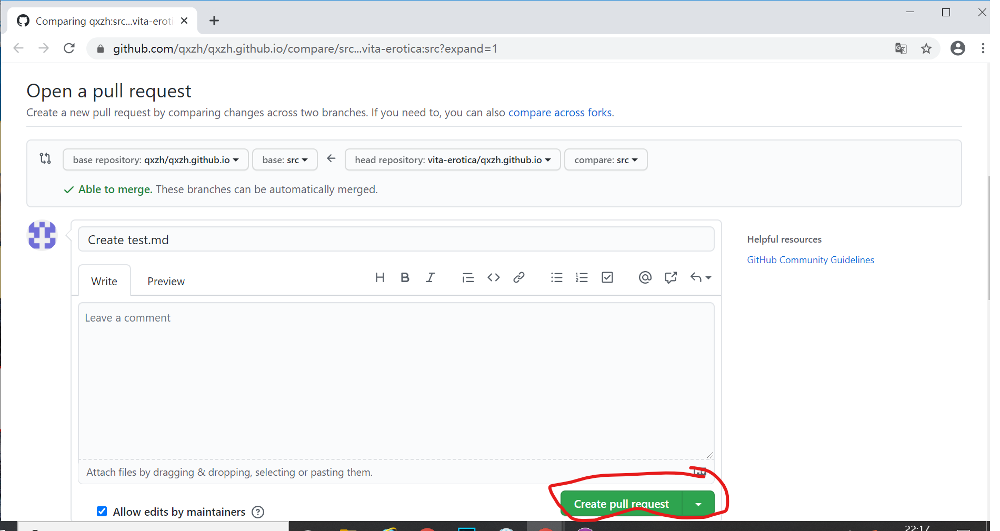

零基础！每个小可爱都能看懂！

<!--more-->

# 概述（Git, GitHub, GitHub Pages, GitHub Actions, HTML, Markdown, Hexo）

本站现在包含很多很多的文档，例如点击链接 https://qxzh.github.io/contents/ 就能看到教程的目录页面。

> 这是为什么呢？

当你点击一个链接的时候，服务器会向你发送一个 HTML 文件，这个文件包含了文字以及你看到的各种样式。但是呢，由于 HTML 文件非常复杂，我们一般并不直接编写这个 HTML 文件，而是先写一个 Markdown 文件，然后将它转换为 HTML 文件，这个转换的软件叫做博客引擎，转换的过程叫做渲染，本站用的博客引擎是 Hexo。

> 那么什么是 Markdown 文件呢？

Markdown 是一种标记语言，它可以通过向文字中加入标记符号的方式来指定哪些文字采用什么样的格式。具体的编写方法会在第四部分介绍。现在，为了更好地编写这些 Markdown 文件，我们需要版本控制软件——Git。

> 什么是版本控制软件？

版本控制软件会在你编写文档的过程中持续记录文档的状态，这样我们就可以放心地进行不断修改而不用担心丢失以前的内容了。此外，版本控制软件还允许多个人共同编写一份文档，分析出每个人修改的不同内容并进行合并。Git 就是一个这样的软件，我们把由 Git 控制的一个文件夹及其中所有的文件称为一个仓库。

> GitHub 是干什么的？

GitHub 是存放仓库的一个服务器，你可以理解为网盘，我们通过 GitHub 为中介进行上传下载。但是这个网盘除了存储之外还有非常多实用的功能。比如，在以前你想建一个网站可能需要自己买服务器，但是现在你只需要注册一个帐号（比如用户名是 `username`），然后在这个帐号下新建一个叫 `username.github.io` 的仓库，向这个仓库里上传 HTML 文件之后别人就可以访问 https://username.github.io 来看到这些文件了，是不是很厉害呢！GitHub 的这个功能叫 GitHub Pages，本站的全部内容都在仓库 https://github.com/qxzh/qxzh.github.io 里。

一个仓库可以包含多个分支。https://github.com/qxzh/qxzh.github.io 这个仓库里面有两个分支：`master` 分支存放的是 HTML 文件，我们不需要去管它；`src` 分支（取自英文 source 的简写）存放的是 Markdown 文件。每次我们向这个仓库推送 Markdown 文件的更新，都会触发 Hexo 引擎把这些 Markdown 文件渲染成 HTML 文件。

> 说了这么多，我要做什么呢？

你要做这几件事：

1. 注册一个 GitHub 帐号，把本站的仓库复制一份到你的帐号下面（这个过程称为 Fork）；
2. 利用 GitHub Desktop 软件把这个仓库下载到你自己的电脑上；
3. 编辑仓库中的文档；
4. 上传这些文档到自己的 GitHub 仓库；
5. 把自己的仓库合并到本站的仓库。

# 注册 GitHub 帐号并 Fork 仓库

首先访问 [GitHub](https://github.com)，在输入框中填写信息，完成注册。以下我们会用 `vita-erotica` 这一名称作为用户名完成演示。


注册完成后，访问[本站的仓库](https://github.com/qxzh/qxzh.github.io)，点击右上角的 Fork：



Fork 完成后，就可以关闭该网页，进行下一步。

# 安装 GitHub Desktop 并下载仓库

访问 [GitHub Desktop](https://desktop.github.com)，下载桌面版 GitHub 客户端，如果你不能访问该网站则在「樱桃栽培技术研发」群文件中下载。安装后，点击左上角 File - Options，输入刚才注册的帐号密码登录：



登录后，你就可以看到你刚才 Fork 的仓库。点击 Clone 将其下载到你的电脑上：


在 Clone 时你需要选择一个地址用于保存，我选择的是 `C:\tmp\qxzh.github.io`。



# 编写文档

在你刚才选择的目录下，进入 `source/_posts` 目录，就可以看到本站的全部博文。



下面，你可以下载一个 Markdown 编辑器（推荐 [Typora](https://typora.io)）。如果你用了 Typora 编辑器，你可以首先用 `Control + /` 快捷键切换到 Markdown 源码模式在这个编辑器里复制粘贴以下内容：

```markdown
---
title: 标题
date: 2020-08-11 22:00:00
---

摘要

<!--more-->

正文

# 一级标题

## 二级标题

- 列表

1. 列表
```

然后再按一次 `Control + /`，你会看到如下的预览界面：



下面我们来说明上面这些代码各自的作用。

首先，由两组 `---` 分隔开的内容称为 YAML 前言，它指定了博客在网站上显示的标题和发表时间。

其次，博文在网站主页并不是全文展示而是会以卡片的形式展示摘要，摘要和正文通过 `<!--more-->` 标记来分开。摘要一般为对文章内容的一至两句话的总结，会以卡片的形式展示在博客主页。

然后，你可以继续用 Markdown 语法写作正文。在这里仅展示了标题、无序列表和有序列表的用法，对博文的写作基本上已经够用了；如果想了解更多语法，请参见 [Markdown 教程](https://www.runoob.com/markdown/md-tutorial.html)。如果该博文为译文，您还可以选择附上原文。

最后，将该文件保存到刚才的 `_posts` 文件夹下，文件名称建议选用由博文标题中的关键词组成的英文名词性短语（参考其他博文）。

# 提交文档至自己的仓库

完成编写后，我们开始准备提交文档。首先，我们需要在 GitHub Desktop 的 File - Option 选项中切换到 Git 一项，输入本次提交所使用的用户名和邮箱（可以与你 GitHub 帐号的用户名和邮箱相同，也可以不同，例如如果你想匿名提交，就可以使用 Anonymous 作为用户名，`<>` 作为邮箱）。



然后，返回界面并点击 `Commit to src`：



最后，点击 `Push origin` 以上传到你的 GitHub 帐号：


# 推送至 po 的仓库

上传完成后，GitHub Desktop 会提示是否要提交 Pull Request。



点击这个链接，将会在浏览器中打开提交 Pull Request 的界面：



点击完成提交。然后，告诉 po，并等待 ta 把这次 Pull Request 合并到主仓库中，这样就可以在网站上看到这篇文章了！

